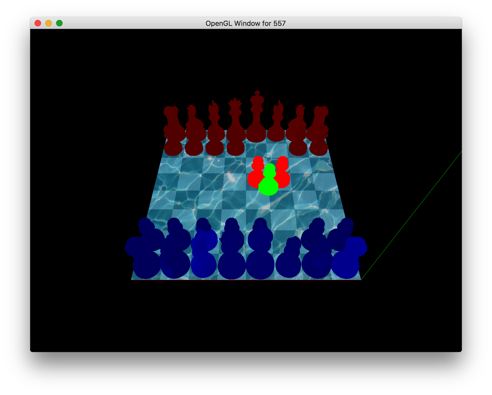

# HCI-557-CG
Code repository for HCI / CS / ME / CpE 557. This repository provides example code and some documentation. 

## Navigation & Collision detection

Collision is detected by rays sticking out multiple directions at the base of the moving piece. Collision detection is only checked with pieces that are within a distance of one tile, so potentially 4 are checked if pieces are configured properly.

A piece is first selected and then moved using the arrow keys. Other pieces that it comes in contact with (to overtake), will highlight red.
